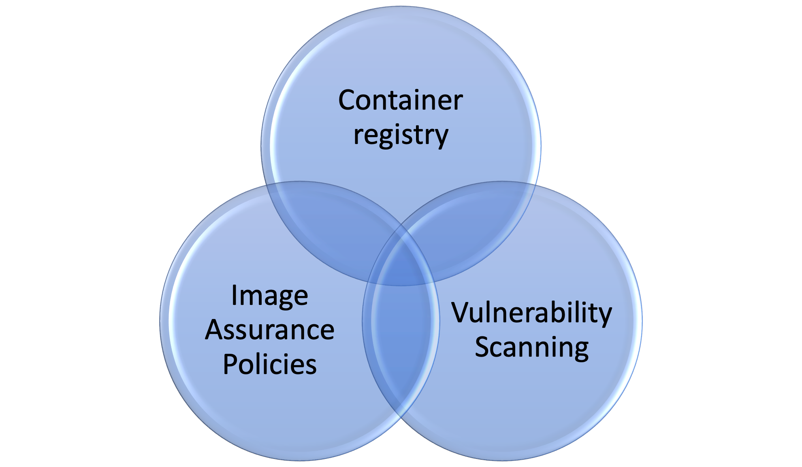

# Advanced Tier Work Package
The consultant will lead the end customer to cover the subjects mentioned below over a one to two day period using this guide. These sessions will be a combination of instructor led training and examples based on real world use cases and provide the customer with the opportunity to carry out the scenarios for themselves.

Topics to cover:
-   Registry Integration
-   Vulnerability Scanning
-   Assurance Policies – Images
-   CI/CD integration
-   SSO/SAML integration

You can break down the time spent working with the customer on these subjects over six to eight sections lasting around two to three hours for each section. Some scenarios may be much shorter to do [ TBD ]

[ insert table and time allocation when other content is defined]

## Showing the relationship between Aqua capabilities

At a high level, Aqua can be configured to scan container images from several supported container registries.

The Venn diagram below represents the relationships between each of the Aqua Components.

[insert diagram]

Naturally, vulnerability scanning cannot happen without integrating the customer’s container registries, and image scanning is dependent upon those registries existing within the Aqua console.

By default, Aqua provides an existing container registry integration out of the box, which is Docker Hub. This can be used to scan public images and is a good starting point to show customers if they want to see this work out of the box.

Additionally, no Image Assurance policies can be applied to images from a repo, without a container registry existing, after the results of an image being pulled and scanned from the image repo within the registry for a particular image.

Aqua provides a set of baseline Image Assurance Policies out of the box, that provide several controls that are applied to the images from the repositories in each container registry.

## Registry Integration

**Session aim**:  to produce a list of the container registries with the customer which they are using and to create registry integrations within their SaaS console so that the customer can begin to scan images from their registry.

As the customer’s consultant you will need to establish whether the customer’s registries are hosted on premise or if they’re using cloud hosted registries, such as Azure ACR, AWS ECR or Google GCR, additionally the other registries that we support are listed here  
[https://docs.aquasec.com/docs/image-registries-and-repositories#section-registry-details-tab](https://docs.aquasec.com/docs/image-registries-and-repositories#section-registry-details-tab)

Where a customer is using on-premises container registries and the Aqua SaaS instance, you will need to configure the Aqua cloud connector before any images from repos can be scanned by Aqua.

Information on how the Aqua cloud connector works and how it is deployed is covered in the link below.  
[https://docs.aquasec.com/docs/aqua-cloud-connector#introduction](https://docs.aquasec.com/docs/aqua-cloud-connector#introduction)

We recommend that you take time to do this in advance to check it works per the customers use case(s) and that you can scan images from the customers on premises registry _or a replicated one of the same type in your own environment_. Allocate at least four hours to configure an on-premises container registry which is the. Same as your customer in conjunction with the Aqua Cloud Connector deployment and config.

## Image Assurance Policies

**Session Aim:** Help the customer identify which Image assurance controls they wish to use for their business and use case and explore which controls fit their needs. It will be of benefit for the customer to show them what happens when one policy control is activated and applied and what the impact is on the scanned images and how a control makes the image non-compliant.  
  
Since Aqua provides two baseline policies for image assurance, one being the **Default** image policy and the other is for **DTA**.

The Default image assurance policy is enough to get the customer started however it does not include any additional controls which means that you will need to get a better understanding of what they will want to include in their policy.

One of the ways to do this is to start with a custom policy with a handful of controls such as the one shown below.

We have provided a copy of this policy in JSON format which is saved to SharePoint in the PS architects [Policy Examples folder](https://aquasecurity.sharepoint.com/:u:/s/CustomerSuccessArchitects/Ef8DeoDr4V9Dl0HKaEZnopwBLGoIJC_uLILvPTWurlaKdg?e=bbDNwu) 

You can customise this policy with the customer by selecting and deselecting the existing controls and even explore small changes with them in their console.

There is also a set of documents in the [PS Architecture SharePoint](https://aquasecurity.sharepoint.com/sites/CustomerSuccessArchitects/Shared%20Documents/Forms/AllItems.aspx?id=%2Fsites%2FCustomerSuccessArchitects%2FShared%20Documents%2FGuides%2FPolicy%20Configuration&viewid=2c0cd9c5%2Dfb91%2D4dd5%2D8362%2D3f8bb3e566f9) that covers best practices for Image Assurance

Since all the Image Assurance policies can be created and applied in a layered fashion, they will control within the policies apply to all images which have been scanned within the Aqua SaaS console and effect the results against each image and additional images that are scanned thereafter.

The impact of this means that if the image does not comply with the assurance polices, that image is deemed as non-compliant. More information about IA can be found on the Documentation portal.

### GitOps  
  
_Do we want to cover this by explaining how policies within aqua can be created, then stored within Github, and for any policy to updated & pushed programmatically into the console using the API via a CI job so that change control can be managed and preventing human error – where policies are applied between Dev/Test –> Non Prod -> Production environments?_

## Vulnerability Scanning

Once your customer has integrated their container registry into the Aqua Saas console, you will be able to guide the customer as to how they start scanning images and producing vulnerability reports.

  
**Session aim**: The consultant should work with the customer to provide a high-level view and example of scanning images from a public docker repo, explaining the Vulnerability results and Risk based insights using the SaaS console.  Explaining to the customer how to interpret and understand the results and what they mean.

First start by selecting a couple of images from Docker hub, such as alpine:3.4 and ubuntu:14.04 to show the customer the kind of information which is obtained about images when they are scanned etc.

You should guide the customer through the scan results for the selected images and provide advice and direction of what this means and cover the tabs and data collected about the image within the UI.  
  

- Scan Queue
- Host Images
- Identifying
- Image compliance reports (PDF download)

Also highlight to the customer that they can find out about a particular image by clicking on the image name in the UI – as highlighted above with the sky blue text and navy blue comments.

You will probably want to show the customer the additional data tabs, such as :

- Vulnerabilities
- Layers
- Resources
- Sensitive data
- Malware
- Information
- Scan history
- Audit tabs

The documentation portal can provide additional information about the information collected and reported by Aqua via CyberCenter.

This will give the customer a better understanding of the data which is presented to them via the UI.

## CI/CD Integration

**Session Aim:** Introduce the customer to the Aqua scanner and integrate it into an example CI build pipeline step as part of a base image or application image creation, being part of the SDLC build. (potentially using the customer’s CI tool)

At a high level Aqua can work scan container images in an ad-hoc manner when combined with a variety of CI tools. It is not uncommon for customers or Enterprise to distribute their development teams across different application types and platform architectures, such as Linux x86 64 bit and Windows Server platforms.  

This could mean that an organization might have a variety of different CI tools, for example a TeamCity CI platform for Windows images and applications and Jenkins or GitLabs for Linux containers and Linux based Apps, or even Azure DevOps.

Speaking with your customer can give you an understand their environment and application landscape before embarking on this task as part of your ongoing workshop.

Build pipelines can be configured to the scanner for a customer and scan images either using the proprietary Aqua CI tool scanner plug-in or via pipeline step by invoking docker.

1. Show the customer how easy it is to scan an image, by creating a Jenkins pipeline to use Aqua scanner Plug-in and parametrise the _Image Name_ as a variable so that any image can be scanned using a Jenkins job by providing build parameters.
2. Demonstrate this pipeline working and explain how this can be used by others in the organisation indirectly without needing to access the Aqua console. I.e., a developer or member of a DevOps team can scan images, as part of the first step to making images compliant.
3. Highlight how Aqua will **_fail_** the pipeline scan if the image being scanned fails the existing Image Assurance policies – you can modify the controls accordingly to show that.
4. Highlight how the image scan results are presented within Jenkins CI as part of the completed job ID and that it’s an HTML representation of the CI/CD scan step which is also present in the Images > CI/CD scans within the UI.
5. Image Scan Webhook use to send scan results and integrate with Postee to provide image build notifications.
<!--stackedit_data:
eyJoaXN0b3J5IjpbLTEyODcxNjY0NTUsLTEyODcxNjY0NTUsLT
Y2NDA2NDczMyw3NTkyNDM5MzUsLTE3MzMzMDM1ODgsMTc0Nzc2
NzQwOF19
-->
